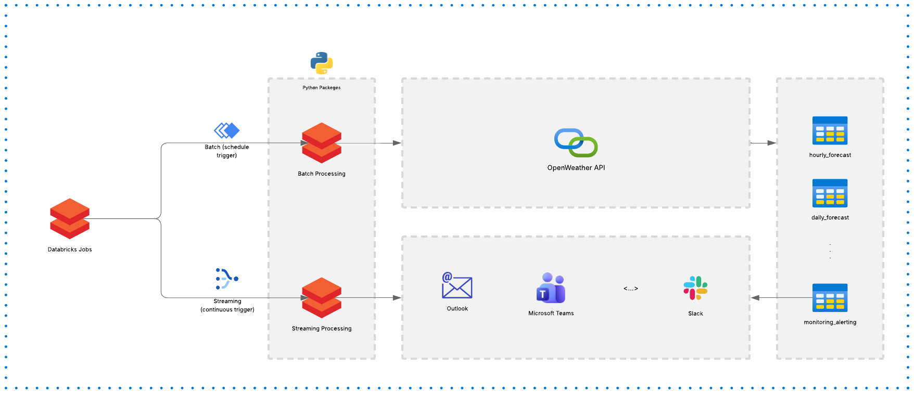
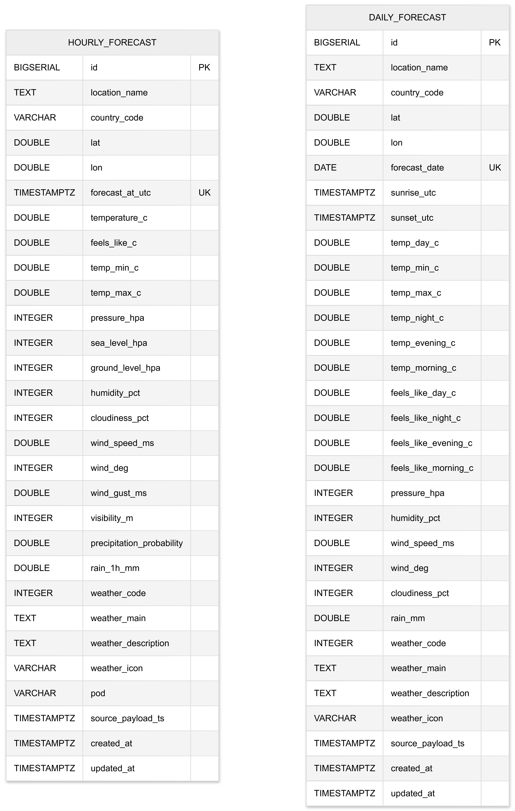

# Weather ETL Solution Architecture

## 1) Context and Goal

This project implements a weather ETL pipeline for tourism planning, ingesting OpenWeather forecast data and loading normalized records into PostgreSQL.

The current codebase is Python-first and can run as a CLI. The target operating model is Databricks-native orchestration using:

- Databricks Asset Bundles (deployment and environment promotion)
- Databricks Jobs (scheduling and execution)
- Built-in monitoring, alerting, and run observability

## 2) Architecture Overview

### Current Runtime Architecture (Codebase Today)

1. CLI entrypoints trigger ETL paths:
   - `weather-etl run-hourly`
   - `weather-etl run-daily`
2. Settings are loaded from environment variables (`Settings.from_env()`).
3. A resilient HTTP client calls OpenWeather Pro endpoints.
4. Raw payloads are normalized into typed records.
5. Records are upserted into PostgreSQL tables in `weather` schema.

### Target Runtime Architecture (Databricks Planned)

1. Code is packaged and deployed via Databricks Asset Bundles.
2. Two Databricks Jobs run independently:
   - Hourly forecast job (`run-hourly`)
   - Daily forecast job (`run-daily`)
3. Jobs execute Python wheel tasks or Python script tasks with environment-specific secrets.
4. Databricks Jobs handles schedules, retries, run history, and notifications.
5. Monitoring/alerting is configured using job-level notifications and workspace observability.

## 3) Proposed Architecture Diagram

### Diagram

<!-- Replace with actual exported image -->

## 4) Technology Stack

- **Language**: Python 3.11+
- **CLI**: Typer
- **HTTP Client**: httpx
- **Database Access**: psycopg (PostgreSQL)
- **Data Modeling**: dataclasses + strict typing
- **Quality**: mypy (strict), Ruff, pytest
- **Packaging**: hatchling wheel build (`uv build`)
- **Target Orchestration**: Databricks Jobs
- **Target Deployment**: Databricks Asset Bundles

## 5) Source Code Logic Walkthrough

### `src/weather_etl/__main__.py`

- Defines CLI with two commands:
  - `run_hourly()`: extracts 4-day hourly forecast and loads `hourly_forecast`.
  - `run_daily()`: extracts 30-day daily forecast and loads `daily_forecast`.
- Uses cached settings (`@cache`) to avoid repeated env parsing.
- Creates:
  - `OpenWeatherClient` (extract)
  - `PostgresLoader` (load)
- Shared flow:
  1. `init_schema()`
  2. fetch API payload
  3. normalize to typed records
  4. upsert to PostgreSQL
  5. log loaded row count

### `src/weather_etl/common/config.py`

- `Settings` dataclass centralizes runtime configuration.
- `from_env()` validates required env vars (`OPENWEATHER_API_KEY`, coordinates), parses numeric values, and sets safe defaults for retry/timeout/backoff.

### `src/weather_etl/ingestion/openweather_client.py`

- Encapsulates OpenWeather API calls with:
  - timeout support
  - retry with exponential backoff
  - `429` handling via `Retry-After`
  - local rate limiter (`RateLimiter`)
- Public methods:
  - `fetch_hourly_4d(...)`
  - `fetch_daily_30d(...)`

### `src/weather_etl/ingestion/ops/transform/normalize.py`

- Converts raw JSON payloads into:
  - `HourlyForecastRecord`
  - `DailyForecastRecord`
- Handles optional fields and type coercion helpers:
  - `_epoch_to_dt`
  - `_to_int_or_none`
  - `_to_float_or_none`

### `src/weather_etl/ingestion/ops/load/postgres_loader.py`

- Reads DDL from `src/weather_etl/sql/schema.sql`.
- Ensures schema/tables/indexes exist (`init_schema`).
- Performs idempotent writes using `ON CONFLICT DO UPDATE`:
  - unique key `(lat, lon, forecast_at_utc)` for hourly
  - unique key `(lat, lon, forecast_date)` for daily

### `src/weather_etl/ingestion/models/types.py`

- Defines typed domain records used between transform and load layers.
- Keeps schema alignment explicit and reduces mapping ambiguity.

## 6) Database ERD (From `schema.sql`)

### ERD

<!-- Replace with actual exported image -->

Notes:

- There is no direct foreign key between hourly and daily forecast tables.
- Both entities are keyed by `(lat, lon)` plus their forecast time grain (timestamp vs date).
- Additional indexes exist on `forecast_at_utc`, `forecast_date`, and `country_code`.

## 7) Databricks Deployment and Operations (Planned)

### Asset Bundles

Recommended bundle design:

- `databricks.yml` for bundle metadata and targets (dev/staging/prod).
- Job resources defining two independent jobs.
- Environment-specific variables/secrets for API key and database DSN.

### Jobs and Scheduling

- **Hourly Job**:
  - Task executes `weather-etl run-hourly`
  - Suggested schedule: every 60 minutes
- **Daily Job**:
  - Task executes `weather-etl run-daily`
  - Suggested schedule: daily or every 12/24h depending on business SLA

### Monitoring and Alerting

Use Databricks built-in features:

- Job run history and duration tracking
- Retry policy per task/job
- Notifications on success/failure/timeout (email/webhook destinations)
- Alert rules for repeated failures, long runtimes, and zero-row anomalies (if row-count metrics are emitted to logs/metrics sink)

### Operational Controls

- Separate dev/staging/prod targets in bundle config
- Promotion by bundle deployment, not ad-hoc workspace edits
- Secret scope usage for:
  - `OPENWEATHER_API_KEY`
  - `WEATHER_DB_DSN`

## 8) Reliability and Data Quality Considerations

- API resilience already includes retry + backoff + throttling.
- DB writes are idempotent due to unique keys and conflict upserts.
- SQL constraints enforce domain quality bounds (humidity/pop/wind/rain checks).
- Recommended extension for production:
  - add explicit row-count and freshness checks per run
  - emit structured metrics to support alert thresholds

## 9) References

- OpenWeather API: https://openweathermap.org/api
- OpenWeather Hourly Forecast: https://openweathermap.org/forecast5
- OpenWeather 30-day Climate (Pro): https://openweathermap.org/api/forecast30
- Databricks Asset Bundles: https://docs.databricks.com/en/dev-tools/bundles/index.html
- Databricks Jobs: https://docs.databricks.com/en/jobs/index.html
- Databricks Job notifications: https://docs.databricks.com/en/jobs/notifications.html
- Psycopg 3: https://www.psycopg.org/psycopg3/docs/
